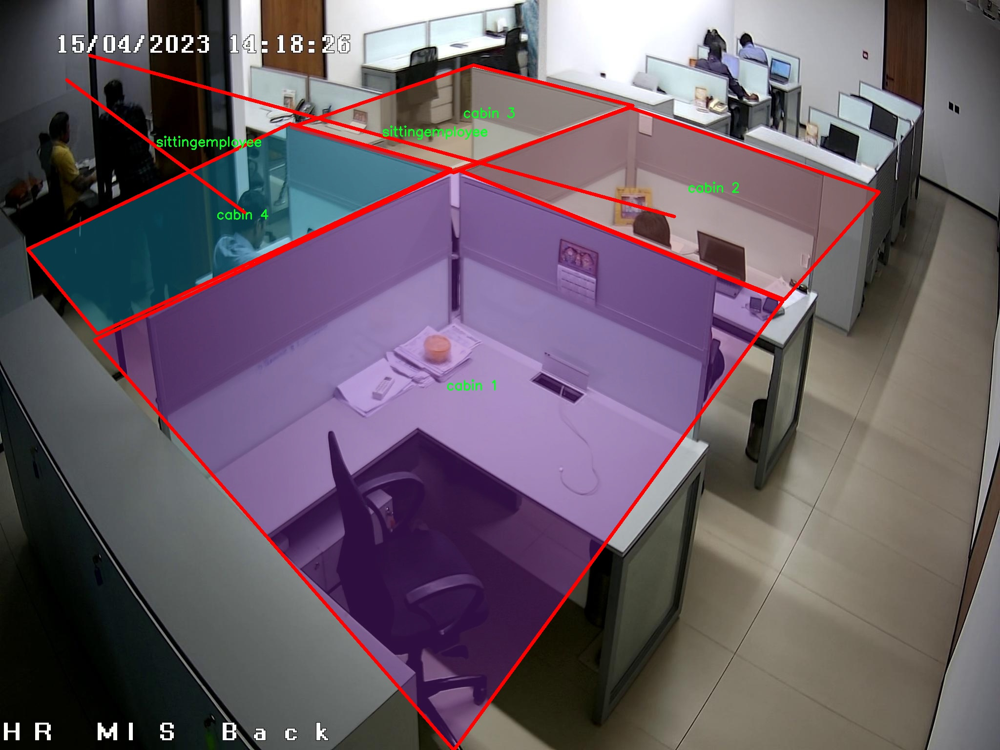

### 1.背景意义

研究背景与意义

随着工业自动化和智能化的快速发展，企业对员工行为监测和工作效率提升的需求日益增强。传统的人工监测方式不仅效率低下，而且容易受到主观因素的影响，难以实现实时、准确的行为分析。因此，基于计算机视觉技术的自动化监测系统逐渐成为研究的热点。尤其是在工位区域，如何有效地监测员工的在岗状态和行为模式，对于提升工作效率、保障安全生产具有重要意义。

本研究旨在基于改进的YOLOv11模型，构建一个工位区域员工在岗检测与行为监测的图像分割系统。该系统能够实时识别和分析员工在不同工位的行为状态，包括静坐和移动等行为。这一系统的核心在于利用深度学习技术，通过对工位区域的图像进行分割和分类，识别出员工的具体行为，并提供数据支持以优化人力资源管理。

本研究所使用的数据集包含六个类别，包括四个工位舱和两种员工行为（移动员工和静坐员工），共计512幅经过预处理和增强的图像。这些数据的多样性和丰富性为模型的训练提供了坚实的基础，使得系统能够在复杂的工作环境中保持高效的识别能力。通过对员工行为的实时监测，企业可以及时发现潜在的安全隐患和效率问题，从而采取相应的措施进行调整和优化。

综上所述，基于改进YOLOv11的员工行为监测系统不仅能够提升企业的管理效率，还能为智能制造和工业4.0的发展提供有力支持。随着技术的不断进步，该系统的应用前景广阔，能够为各类企业提供更加科学、合理的管理方案。

### 2.视频效果

[2.1 视频效果](https://www.bilibili.com/video/BV1TZUnYvEH1/)

### 3.图片效果


##### [项目涉及的源码数据来源链接](https://kdocs.cn/l/cszuIiCKVNis)**

注意：本项目提供训练的数据集和训练教程,由于版本持续更新,暂不提供权重文件（best.pt）,请按照6.训练教程进行训练后实现上图演示的效果。

### 4.数据集信息

##### 4.1 本项目数据集类别数＆类别名

nc: 6
names: ['cabin 1', 'cabin 2', 'cabin 3', 'cabin 4', 'movingemployee', 'sittingemployee']


该项目为【图像分割】数据集，请在【训练教程和Web端加载模型教程（第三步）】这一步的时候按照【图像分割】部分的教程来训练

##### 4.2 本项目数据集信息介绍

本项目数据集信息介绍

本项目所使用的数据集专注于工位区域员工在岗检测与行为监测，旨在通过改进YOLOv11模型实现对员工行为的精准识别与图像分割。数据集的主题围绕“securi”，强调了在工作环境中保障安全与效率的重要性。该数据集包含六个类别，具体为“cabin 1”、“cabin 2”、“cabin 3”、“cabin 4”、“movingemployee”和“sittingemployee”。这些类别不仅涵盖了不同的工作舱位，还细分了员工的动态行为状态，提供了丰富的场景与行为数据。

在数据采集过程中，我们确保了数据的多样性与代表性，以便于模型在实际应用中能够适应不同的工作环境和员工行为。每个舱位类别代表了特定的工作区域，这些区域的设计考虑了员工的工作习惯与安全需求。同时，员工行为的分类则有助于实时监测员工的在岗状态，识别是否存在违规行为或安全隐患。例如，“movingemployee”类别用于标识在工作区域内移动的员工，而“sittingemployee”则专注于那些处于静止状态的员工。通过这种细致的分类，我们能够更好地分析员工的工作模式，进而优化工作流程与安全管理。

数据集的构建过程中，所有图像均经过严格标注，确保了高质量的训练数据。每个类别的样本数量经过精心设计，以保证模型在训练时能够充分学习到各类特征。通过这种方式，我们希望提升YOLOv11在员工行为监测任务中的准确性与鲁棒性，为未来的智能监控系统奠定坚实的基础。总之，本项目的数据集不仅为技术开发提供了必要的支持，也为实现更高效的工作环境管理开辟了新的可能性。




### 5.全套项目环境部署视频教程（零基础手把手教学）

[5.1 所需软件PyCharm和Anaconda安装教程（第一步）](https://www.bilibili.com/video/BV1BoC1YCEKi/?spm_id_from=333.999.0.0&vd_source=bc9aec86d164b67a7004b996143742dc)


[5.2 安装Python虚拟环境创建和依赖库安装视频教程（第二步）](https://www.bilibili.com/video/BV1ZoC1YCEBw?spm_id_from=333.788.videopod.sections&vd_source=bc9aec86d164b67a7004b996143742dc)

### 6.改进YOLOv11训练教程和Web_UI前端加载模型教程（零基础手把手教学）

[6.1 改进YOLOv11训练教程和Web_UI前端加载模型教程（第三步）](https://www.bilibili.com/video/BV1BoC1YCEhR?spm_id_from=333.788.videopod.sections&vd_source=bc9aec86d164b67a7004b996143742dc)


按照上面的训练视频教程链接加载项目提供的数据集，运行train.py即可开始训练



     Epoch   gpu_mem       box       obj       cls    labels  img_size
     1/200     20.8G   0.01576   0.01955  0.007536        22      1280: 100%|██████████| 849/849 [14:42<00:00,  1.04s/it]
               Class     Images     Labels          P          R     mAP@.5 mAP@.5:.95: 100%|██████████| 213/213 [01:14<00:00,  2.87it/s]
                 all       3395      17314      0.994      0.957      0.0957      0.0843

     Epoch   gpu_mem       box       obj       cls    labels  img_size
     2/200     20.8G   0.01578   0.01923  0.007006        22      1280: 100%|██████████| 849/849 [14:44<00:00,  1.04s/it]
               Class     Images     Labels          P          R     mAP@.5 mAP@.5:.95: 100%|██████████| 213/213 [01:12<00:00,  2.95it/s]
                 all       3395      17314      0.996      0.956      0.0957      0.0845

     Epoch   gpu_mem       box       obj       cls    labels  img_size
     3/200     20.8G   0.01561    0.0191  0.006895        27      1280: 100%|██████████| 849/849 [10:56<00:00,  1.29it/s]
               Class     Images     Labels          P          R     mAP@.5 mAP@.5:.95: 100%|███████   | 187/213 [00:52<00:00,  4.04it/s]
                 all       3395      17314      0.996      0.957      0.0957      0.0845


###### [项目数据集下载链接](https://kdocs.cn/l/cszuIiCKVNis)

### 7.原始YOLOv11算法讲解

YOLO11采用改进的骨干和颈部架构，增强了特征提取能力，提高了物体检测的精确度和复杂任务的表现。YOLO11引入精炼的架构设计和优化的训练流程，实现更快的处理速度，同时保持精度和性能之间的最佳平衡。通过模型设计的进步，YOLO11m在COCO数据集上实现了更高的均值平均精度（mAP），同时使用比YOLOv8m少22%的参数，使其在不妥协准确性的情况下更加计算高效。YOLO11可以无缝部署在各种环境中，包括边缘设备、云平台以及支持NVIDIA
GPU的系统，确保最大灵活性。无论是物体检测、实例分割、图像分类、姿态估计，还是定向物体检测（OBB），YOLO11都旨在应对多样的计算机视觉挑战。


##### **Ultralytics YOLO11相比于之前版本的主要改进有哪些？**

Ultralytics YOLO11在其前身基础上引入了几项重要进步。主要改进包括：

  1. **增强的特征提取** ：YOLO11采用改进的骨干和颈部架构，增强了特征提取能力，提高了物体检测的精确度。
  2.  **优化的效率和速度** ：精炼的架构设计和优化的训练流程实现了更快的处理速度，同时保持了准确性和性能之间的平衡。
  3.  **更高的准确性与更少的参数** ：YOLO11m在COCO数据集上实现了更高的均值平均精度（mAP），同时使用比YOLOv8m少22%的参数，使其在不妥协准确性的情况下更加计算高效。
  4.  **环境适应性强** ：YOLO11可以在多种环境中部署，包括边缘设备、云平台以及支持NVIDIA GPU的系统。
  5.  **支持广泛的任务** ：YOLO11支持多种计算机视觉任务，如物体检测、实例分割、图像分类、姿态估计和定向物体检测（OBB）。

我们先来看一下其网络结构有什么变化，可以看出，相比较于YOLOv8模型，其将CF2模块改成C3K2，同时在SPPF模块后面添加了一个C2PSA模块，且将YOLOv10的head思想引入到YOLO11的head中，使用深度可分离的方法，减少冗余计算，提高效率。下面我们来详细看一下这两个模块的结构是怎么构成的，以及它们为什么要这样设计


##### C3K2的网络结构

从下面图中我们可以看到，C3K2模块其实就是C2F模块转变出来的，它代码中有一个设置，就是当c3k这个参数为FALSE的时候，C3K2模块就是C2F模块，也就是说它的Bottleneck是普通的Bottleneck；反之当它为true的时候，将Bottleneck模块替换成C3模块。


##### C2PSA的网络结构

` `C2PSA是对 `C2f` 模块的扩展，它结合了PSA(Pointwise Spatial
Attention)块，用于增强特征提取和注意力机制。通过在标准 `C2f` 模块中引入 PSA
块，C2PSA实现了更强大的注意力机制，从而提高了模型对重要特征的捕捉能力。


##### **C2f 模块回顾：**

**** C2f模块是一个更快的 CSP（Cross Stage Partial）瓶颈实现，它通过两个卷积层和多个 Bottleneck
块进行特征提取。相比传统的 CSPNet，C2f 优化了瓶颈层的结构，使得计算速度更快。在 C2f中，`cv1` 是第一个 1x1
卷积，用于减少通道数；`cv2` 是另一个 1x1 卷积，用于恢复输出通道数。而 `n` 是一个包含 Bottleneck 块的数量，用于提取特征。

##### **C2PSA 模块的增强** ：

**C2PSA** 扩展了 C2f，通过引入PSA( **Position-Sensitive Attention)**
，旨在通过多头注意力机制和前馈神经网络来增强特征提取能力。它可以选择性地添加残差结构（shortcut）以优化梯度传播和网络训练效果。同时，使用FFN
可以将输入特征映射到更高维的空间，捕获输入特征的复杂非线性关系，允许模型学习更丰富的特征表示。

##### head部分

YOLO11在head部分的cls分支上使用深度可分离卷积 ，具体代码如下，cv2边界框回归分支，cv3分类分支。

    
    
     self.cv2 = nn.ModuleList(
                nn.Sequential(Conv(x, c2, 3), Conv(c2, c2, 3), nn.Conv2d(c2, 4 * self.reg_max, 1)) for x in ch
            )
            self.cv3 = nn.ModuleList(
                nn.Sequential(
                    nn.Sequential(DWConv(x, x, 3), Conv(x, c3, 1)),
                    nn.Sequential(DWConv(c3, c3, 3), Conv(c3, c3, 1)),
                    nn.Conv2d(c3, self.nc, 1),
                )
                for x in ch
            )


### 8.200+种全套改进YOLOV11创新点原理讲解

#### 8.1 200+种全套改进YOLOV11创新点原理讲解大全

由于篇幅限制，每个创新点的具体原理讲解就不全部展开，具体见下列网址中的改进模块对应项目的技术原理博客网址【Blog】（创新点均为模块化搭建，原理适配YOLOv5~YOLOv11等各种版本）

[改进模块技术原理博客【Blog】网址链接](https://gitee.com/qunmasj/good)


#### 8.2 精选部分改进YOLOV11创新点原理讲解

###### 这里节选部分改进创新点展开原理讲解(完整的改进原理见上图和[改进模块技术原理博客链接](https://gitee.com/qunmasj/good)【如果此小节的图加载失败可以通过CSDN或者Github搜索该博客的标题访问原始博客，原始博客图片显示正常】

### Gold-YOLO简介
YOLO再升级：华为诺亚提出Gold-YOLO，聚集-分发机制打造新SOTA
在过去的几年中，YOLO系列模型已经成为实时目标检测领域的领先方法。许多研究通过修改架构、增加数据和设计新的损失函数，将基线推向了更高的水平。然而以前的模型仍然存在信息融合问题，尽管特征金字塔网络（FPN）和路径聚合网络（PANet）已经在一定程度上缓解了这个问题。因此，本研究提出了一种先进的聚集和分发机制（GD机制），该机制通过卷积和自注意力操作实现。这种新设计的模型被称为Gold-YOLO，它提升了多尺度特征融合能力，在所有模型尺度上实现了延迟和准确性的理想平衡。此外，本文首次在YOLO系列中实现了MAE风格的预训练，使得YOLO系列模型能够从无监督预训练中受益。Gold-YOLO-N在COCO val2017数据集上实现了出色的39.9% AP，并在T4 GPU上实现了1030 FPS，超过了之前的SOTA模型YOLOv6-3.0-N，其FPS相似，但性能提升了2.4%。


#### Gold-YOLO


YOLO系列的中间层结构采用了传统的FPN结构，其中包含多个分支用于多尺度特征融合。然而，它只充分融合来自相邻级别的特征，对于其他层次的信息只能间接地进行“递归”获取。

传统的FPN结构在信息传输过程中存在丢失大量信息的问题。这是因为层之间的信息交互仅限于中间层选择的信息，未被选择的信息在传输过程中被丢弃。这种情况导致某个Level的信息只能充分辅助相邻层，而对其他全局层的帮助较弱。因此，整体上信息融合的有效性可能受到限制。
为了避免在传输过程中丢失信息，本文采用了一种新颖的“聚集和分发”机制（GD），放弃了原始的递归方法。该机制使用一个统一的模块来收集和融合所有Level的信息，并将其分发到不同的Level。通过这种方式，作者不仅避免了传统FPN结构固有的信息丢失问题，还增强了中间层的部分信息融合能力，而且并没有显著增加延迟。


# 8.低阶聚合和分发分支 Low-stage gather-and-distribute branch
从主干网络中选择输出的B2、B3、B4、B5特征进行融合，以获取保留小目标信息的高分辨率特征。


低阶特征对齐模块 (Low-stage feature alignment module)： 在低阶特征对齐模块（Low-FAM）中，采用平均池化（AvgPool）操作对输入特征进行下采样，以实现统一的大小。通过将特征调整为组中最小的特征大小（ R B 4 = 1 / 4 R ） （R_{B4} = 1/4R）（R 
B4 =1/4R），我们得到对齐后的特征F a l i g n F_{align}F align 。低阶特征对齐技术确保了信息的高效聚合，同时通过变换器模块来最小化后续处理的计算复杂性。其中选择 R B 4 R_{B4}R B4 作为特征对齐的目标大小主要基于保留更多的低层信息的同时不会带来较大的计算延迟。
低阶信息融合模块(Low-stage information fusion module)： 低阶信息融合模块（Low-IFM）设计包括多层重新参数化卷积块（RepBlock）和分裂操作。具体而言，RepBlock以F a l i g n ( c h a n n e l = s u m ( C B 2 ， C B 3 ， C B 4 ， C B 5 ) ) F_{align} (channel= sum(C_{B2}，C_{B3}，C_{B4}，C_{B5}))F align (channel=sum(C B2 ，C B3 ，C B4 ，C B5 )作为输入，并生成F f u s e ( c h a n n e l = C B 4 + C B 5 ) F_{fuse} (channel= C_{B4} + C_{B5})F fuse (channel=C B4 +C B5 )。其中中间通道是一个可调整的值（例如256），以适应不同的模型大小。由RepBlock生成的特征随后在通道维度上分裂为F i n j P 3 Finj_P3Finj P 3和F i n j P 4 Finj_P4Finj P 4，然后与不同级别的特征进行融合。


# 8.高阶聚合和分发分支 High-stage gather-and-distribute branch
高级全局特征对齐模块（High-GD）将由低级全局特征对齐模块（Low-GD）生成的特征{P3, P4, P5}进行融合。


高级特征对齐模块(High-stage feature alignment module)： High-FAM由avgpool组成，用于将输入特征的维度减小到统一的尺寸。具体而言，当输入特征的尺寸为{R P 3 R_{P3}R P3 , R P 4 R_{P4}R P4 , R P 5 R_{P 5}R P5 }时，avgpool将特征尺寸减小到该特征组中最小的尺寸（R P 5 R_{P5}R P5  = 1/8R）。由于transformer模块提取了高层次的信息，池化操作有助于信息聚合，同时降低了transformer模块后续步骤的计算需求。

Transformer融合模块由多个堆叠的transformer组成，transformer块的数量为L。每个transformer块包括一个多头注意力块、一个前馈网络（FFN）和残差连接。采用与LeViT相同的设置来配置多头注意力块，使用16个通道作为键K和查询Q的头维度，32个通道作为值V的头维度。为了加速推理过程，将层归一化操作替换为批归一化，并将所有的GELU激活函数替换为ReLU。为了增强变换器块的局部连接，在两个1x1卷积层之间添加了一个深度卷积层。同时，将FFN的扩展因子设置为2，以在速度和计算成本之间取得平衡。

信息注入模块(Information injection module)： 高级全局特征对齐模块（High-GD）中的信息注入模块与低级全局特征对齐模块（Low-GD）中的相同。在高级阶段，局部特征（Flocal）等于Pi，因此公式如下所示：


### 增强的跨层信息流动 Enhanced cross-layer information flow
为了进一步提升性能，从YOLOv11 中的PAFPN模块中得到启发，引入了Inject-LAF模块。该模块是注入模块的增强版，包括了一个轻量级相邻层融合（LAF）模块，该模块被添加到注入模块的输入位置。为了在速度和准确性之间取得平衡，设计了两个LAF模型：LAF低级模型和LAF高级模型，分别用于低级注入（合并相邻两层的特征）和高级注入（合并相邻一层的特征）。它们的结构如图5(b)所示。为了确保来自不同层级的特征图与目标大小对齐，在实现中的两个LAF模型仅使用了三个操作符：双线性插值（上采样过小的特征）、平均池化（下采样过大的特征）和1x1卷积（调整与目标通道不同的特征）。模型中的LAF模块与信息注入模块的结合有效地平衡了准确性和速度之间的关系。通过使用简化的操作，能够增加不同层级之间的信息流路径数量，从而提高性能而不显著增加延迟。


### 9.系统功能展示

图9.1.系统支持检测结果表格显示

  图9.2.系统支持置信度和IOU阈值手动调节

  图9.3.系统支持自定义加载权重文件best.pt(需要你通过步骤5中训练获得)

  图9.4.系统支持摄像头实时识别

  图9.5.系统支持图片识别

  图9.6.系统支持视频识别

  图9.7.系统支持识别结果文件自动保存

  图9.8.系统支持Excel导出检测结果数据


### 10. YOLOv11核心改进源码讲解

#### 10.1 SMPConv.py

以下是对代码中最核心部分的提取和详细中文注释：

```python
import torch
import torch.nn as nn
import torch.nn.functional as F

# 定义相对位置的函数
def rel_pos(kernel_size):
    # 创建一个从-1到1的线性空间，大小为kernel_size
    tensors = [torch.linspace(-1, 1, steps=kernel_size) for _ in range(2)]
    # 生成网格坐标
    kernel_coord = torch.stack(torch.meshgrid(*tensors), dim=-0)
    kernel_coord = kernel_coord.unsqueeze(0)  # 增加一个维度
    return kernel_coord

# 定义SMPConv类，继承自nn.Module
class SMPConv(nn.Module):
    def __init__(self, planes, kernel_size, n_points, stride, padding, groups):
        super().__init__()

        self.planes = planes  # 输出通道数
        self.kernel_size = kernel_size  # 卷积核大小
        self.n_points = n_points  # 采样点数
        self.init_radius = 2 * (2/kernel_size)  # 初始化半径

        # 生成卷积核坐标
        kernel_coord = rel_pos(kernel_size)
        self.register_buffer('kernel_coord', kernel_coord)  # 注册为buffer，不会被视为模型参数

        # 权重坐标初始化
        weight_coord = torch.empty(1, n_points, 2)
        nn.init.trunc_normal_(weight_coord, std=0.2, a=-1., b=1.)  # 使用截断正态分布初始化
        self.weight_coord = nn.Parameter(weight_coord)  # 将其作为可训练参数

        # 半径参数初始化
        self.radius = nn.Parameter(torch.empty(1, n_points).unsqueeze(-1).unsqueeze(-1))
        self.radius.data.fill_(value=self.init_radius)  # 填充初始值

        # 权重初始化
        weights = torch.empty(1, planes, n_points)
        nn.init.trunc_normal_(weights, std=.02)  # 使用截断正态分布初始化
        self.weights = nn.Parameter(weights)  # 将其作为可训练参数

    def forward(self, x):
        # 生成卷积核并进行前向传播
        kernels = self.make_kernels().unsqueeze(1)  # 生成卷积核
        x = x.contiguous()  # 确保输入是连续的
        kernels = kernels.contiguous()  # 确保卷积核是连续的

        # 根据输入数据类型选择相应的深度可分离卷积实现
        if x.dtype == torch.float32:
            x = _DepthWiseConv2dImplicitGEMMFP32.apply(x, kernels)
        elif x.dtype == torch.float16:
            x = _DepthWiseConv2dImplicitGEMMFP16.apply(x, kernels)
        else:
            raise TypeError("Only support fp32 and fp16, get {}".format(x.dtype))
        return x        

    def make_kernels(self):
        # 计算卷积核
        diff = self.weight_coord.unsqueeze(-2) - self.kernel_coord.reshape(1, 2, -1).transpose(1, 2)  # 计算坐标差
        diff = diff.transpose(2, 3).reshape(1, self.n_points, 2, self.kernel_size, self.kernel_size)  # 重塑形状
        diff = F.relu(1 - torch.sum(torch.abs(diff), dim=2) / self.radius)  # 计算权重

        # 计算最终的卷积核
        kernels = torch.matmul(self.weights, diff.reshape(1, self.n_points, -1))  # 计算加权卷积核
        kernels = kernels.reshape(1, self.planes, *self.kernel_coord.shape[2:])  # 重塑为卷积核形状
        kernels = kernels.squeeze(0)  # 去掉多余的维度
        kernels = torch.flip(kernels.permute(0, 2, 1), dims=(1,))  # 反转卷积核
        return kernels

# 定义SMPCNN类，继承自nn.Module
class SMPCNN(nn.Module):
    def __init__(self, in_channels, out_channels, kernel_size, stride, groups, n_points=None, n_points_divide=4):
        super().__init__()
        self.kernel_size = kernel_size
        if n_points is None:
            n_points = int((kernel_size**2) // n_points_divide)  # 计算采样点数

        padding = kernel_size // 2  # 计算填充
        self.smp = conv_bn(in_channels=in_channels, out_channels=out_channels, kernel_size=kernel_size,
                           stride=stride, padding=padding, dilation=1, groups=groups, n_points=n_points)
        
        self.small_kernel = 5  # 小卷积核大小
        self.small_conv = Conv(in_channels, out_channels, self.small_kernel, stride, self.small_kernel // 2, groups, act=False)  # 小卷积层

    def forward(self, inputs):
        # 前向传播
        out = self.smp(inputs)  # 通过SMP卷积
        out += self.small_conv(inputs)  # 加上小卷积的输出
        return out

# 定义SMPBlock类，继承自nn.Module
class SMPBlock(nn.Module):
    def __init__(self, in_channels, dw_channels, lk_size, drop_path, n_points=None, n_points_divide=4):
        super().__init__()
        self.pw1 = conv_bn_relu(in_channels, dw_channels, 1, 1, 0, groups=1)  # 1x1卷积
        self.pw2 = conv_bn(dw_channels, in_channels, 1, 1, 0, groups=1)  # 1x1卷积
        self.large_kernel = SMPCNN(in_channels=dw_channels, out_channels=dw_channels, kernel_size=lk_size,
                                   stride=1, groups=dw_channels, n_points=n_points, n_points_divide=n_points_divide)  # 大卷积层
        self.lk_nonlinear = nn.ReLU()  # 激活函数
        self.drop_path = DropPath(drop_path) if drop_path > 0. else nn.Identity()  # 路径丢弃

    def forward(self, x):
        # 前向传播
        out = self.pw1(x)  # 通过第一个1x1卷积
        out = self.large_kernel(out)  # 通过大卷积层
        out = self.lk_nonlinear(out)  # 激活
        out = self.pw2(out)  # 通过第二个1x1卷积
        return x + self.drop_path(out)  # 残差连接
```

### 代码核心部分说明：
1. **SMPConv**：实现了一种特殊的卷积操作，使用了相对位置编码和可学习的权重坐标，适用于深度可分离卷积。
2. **SMPCNN**：将SMPConv与小卷积结合，形成一个复合卷积结构。
3. **SMPBlock**：结合了1x1卷积和SMPCNN，形成一个模块化的网络块，支持残差连接和路径丢弃。

这些核心部分构成了该模型的基础，主要用于实现高效的卷积操作和网络结构。

这个文件 `SMPConv.py` 定义了一些用于深度学习模型的卷积模块，主要包括 `SMPConv`、`SMPCNN`、`SMPCNN_ConvFFN` 和 `SMPBlock` 类。以下是对代码的逐步分析和说明。

首先，文件导入了一些必要的库，包括 PyTorch 的核心模块、深度学习相关的功能模块以及自定义的卷积模块。特别是，它尝试导入深度可分离卷积的实现，这对于优化卷积操作的性能非常重要。

`rel_pos` 函数用于生成相对位置的坐标张量，这对于后续的卷积操作是必要的。它创建了一个大小为 `kernel_size` 的网格，返回一个包含相对位置的张量。

`SMPConv` 类是一个自定义的卷积层，它在初始化时接受多个参数，包括输出通道数、卷积核大小、点数、步幅、填充和分组数。它的主要特点是通过相对位置和权重坐标来生成卷积核。`make_kernels` 方法根据权重坐标和相对位置生成卷积核，并在前向传播中使用深度可分离卷积的实现进行卷积操作。`radius_clip` 方法用于限制半径的范围，确保其在合理的范围内。

`get_conv2d` 函数根据输入参数决定返回自定义的 `SMPConv` 还是标准的 `nn.Conv2d`，这使得模型在不同条件下能够灵活选择卷积实现。

`enable_sync_bn` 和 `get_bn` 函数用于选择使用同步批归一化或标准批归一化，这在分布式训练中非常有用。

`conv_bn` 和 `conv_bn_relu` 函数分别用于创建包含卷积层和批归一化层的序列模块，后者还添加了 ReLU 激活函数。这些函数封装了常见的卷积操作，使得模型构建更加简洁。

`fuse_bn` 函数用于将卷积层和批归一化层融合，以提高推理时的效率。

`SMPCNN` 类是一个组合卷积模块，它结合了自定义的 `SMPConv` 和一个小卷积层。它在前向传播中将两个卷积的输出相加，增强了特征提取的能力。

`SMPCNN_ConvFFN` 类实现了一个前馈网络模块，包含两个逐点卷积层和一个非线性激活函数（GELU）。它还使用了 DropPath 技术，以增强模型的泛化能力。

最后，`SMPBlock` 类是一个更复杂的模块，结合了逐点卷积、较大的卷积核和跳跃连接。它通过前向传播将输入和经过处理的输出相加，形成残差连接。

总体而言，这个文件实现了一种灵活且高效的卷积结构，适用于深度学习模型的构建，特别是在处理图像数据时。通过自定义的卷积层和模块组合，模型能够更好地捕捉特征并提高性能。

#### 10.2 kan_conv.py

以下是代码中最核心的部分，并附上详细的中文注释：

```python
import torch
import torch.nn as nn

class KANConvNDLayer(nn.Module):
    def __init__(self, conv_class, norm_class, input_dim, output_dim, spline_order, kernel_size,
                 groups=1, padding=0, stride=1, dilation=1,
                 ndim: int = 2, grid_size=5, base_activation=nn.GELU, grid_range=[-1, 1], dropout=0.0):
        super(KANConvNDLayer, self).__init__()
        
        # 初始化参数
        self.inputdim = input_dim  # 输入维度
        self.outdim = output_dim    # 输出维度
        self.spline_order = spline_order  # 样条的阶数
        self.kernel_size = kernel_size  # 卷积核大小
        self.padding = padding  # 填充
        self.stride = stride  # 步幅
        self.dilation = dilation  # 膨胀率
        self.groups = groups  # 分组数
        self.ndim = ndim  # 维度
        self.grid_size = grid_size  # 网格大小
        self.base_activation = base_activation()  # 基础激活函数
        self.grid_range = grid_range  # 网格范围

        # 初始化 dropout
        self.dropout = None
        if dropout > 0:
            if ndim == 1:
                self.dropout = nn.Dropout1d(p=dropout)
            elif ndim == 2:
                self.dropout = nn.Dropout2d(p=dropout)
            elif ndim == 3:
                self.dropout = nn.Dropout3d(p=dropout)

        # 检查分组数和维度的有效性
        if groups <= 0:
            raise ValueError('groups must be a positive integer')
        if input_dim % groups != 0:
            raise ValueError('input_dim must be divisible by groups')
        if output_dim % groups != 0:
            raise ValueError('output_dim must be divisible by groups')

        # 初始化基础卷积层
        self.base_conv = nn.ModuleList([conv_class(input_dim // groups,
                                                   output_dim // groups,
                                                   kernel_size,
                                                   stride,
                                                   padding,
                                                   dilation,
                                                   groups=1,
                                                   bias=False) for _ in range(groups)])

        # 初始化样条卷积层
        self.spline_conv = nn.ModuleList([conv_class((grid_size + spline_order) * input_dim // groups,
                                                     output_dim // groups,
                                                     kernel_size,
                                                     stride,
                                                     padding,
                                                     dilation,
                                                     groups=1,
                                                     bias=False) for _ in range(groups)])

        # 初始化归一化层
        self.layer_norm = nn.ModuleList([norm_class(output_dim // groups) for _ in range(groups)])

        # 初始化 PReLU 激活函数
        self.prelus = nn.ModuleList([nn.PReLU() for _ in range(groups)])

        # 生成网格
        h = (self.grid_range[1] - self.grid_range[0]) / grid_size
        self.grid = torch.linspace(
            self.grid_range[0] - h * spline_order,
            self.grid_range[1] + h * spline_order,
            grid_size + 2 * spline_order + 1,
            dtype=torch.float32
        )
        
        # 使用 Kaiming 均匀分布初始化卷积层权重
        for conv_layer in self.base_conv:
            nn.init.kaiming_uniform_(conv_layer.weight, nonlinearity='linear')

        for conv_layer in self.spline_conv:
            nn.init.kaiming_uniform_(conv_layer.weight, nonlinearity='linear')

    def forward_kan(self, x, group_index):
        # 处理输入并进行基础卷积
        base_output = self.base_conv[group_index](self.base_activation(x))

        x_uns = x.unsqueeze(-1)  # 扩展维度以进行样条操作
        target = x.shape[1:] + self.grid.shape  # 计算目标形状
        grid = self.grid.view(*list([1 for _ in range(self.ndim + 1)] + [-1, ])).expand(target).contiguous().to(x.device)

        # 计算样条基
        bases = ((x_uns >= grid[..., :-1]) & (x_uns < grid[..., 1:])).to(x.dtype)

        # 计算多阶样条基
        for k in range(1, self.spline_order + 1):
            left_intervals = grid[..., :-(k + 1)]
            right_intervals = grid[..., k:-1]
            delta = torch.where(right_intervals == left_intervals, torch.ones_like(right_intervals),
                                right_intervals - left_intervals)
            bases = ((x_uns - left_intervals) / delta * bases[..., :-1]) + \
                    ((grid[..., k + 1:] - x_uns) / (grid[..., k + 1:] - grid[..., 1:(-k)]) * bases[..., 1:])
        bases = bases.contiguous()
        bases = bases.moveaxis(-1, 2).flatten(1, 2)  # 调整基的形状以适应卷积层
        spline_output = self.spline_conv[group_index](bases)  # 进行样条卷积
        x = self.prelus[group_index](self.layer_norm[group_index](base_output + spline_output))  # 激活和归一化

        if self.dropout is not None:
            x = self.dropout(x)  # 应用 dropout

        return x

    def forward(self, x):
        # 将输入分成多个组并进行处理
        split_x = torch.split(x, self.inputdim // self.groups, dim=1)
        output = []
        for group_ind, _x in enumerate(split_x):
            y = self.forward_kan(_x.clone(), group_ind)  # 处理每个组
            output.append(y.clone())
        y = torch.cat(output, dim=1)  # 合并输出
        return y
```

### 代码说明：
1. **类的初始化**：`__init__` 方法中初始化了卷积层、归一化层、激活函数和 dropout 等参数，并进行了必要的参数验证。
2. **前向传播**：`forward_kan` 方法实现了样条卷积的具体计算，包括样条基的生成和卷积操作。
3. **分组处理**：`forward` 方法将输入数据按组分割，逐组进行处理并合并输出。

这个程序文件定义了一个名为 `KANConvNDLayer` 的神经网络层，主要用于实现基于样条插值的卷积操作。该层可以处理不同维度的数据（如1D、2D和3D），并通过子类 `KANConv1DLayer`、`KANConv2DLayer` 和 `KANConv3DLayer` 实现了对一维、二维和三维卷积的支持。

在 `KANConvNDLayer` 的构造函数中，首先初始化了一些参数，包括输入和输出维度、卷积核大小、样条阶数、分组数、填充、步幅、扩张、网格大小、激活函数、网格范围和丢弃率等。构造函数中还包含了一些输入参数的有效性检查，比如分组数必须为正整数，并且输入和输出维度必须能够被分组数整除。

接下来，构造函数创建了多个子层，包括基础卷积层、样条卷积层、层归一化层和PReLU激活层。基础卷积层和样条卷积层使用 `conv_class` 作为卷积操作的实现类，分别对输入进行卷积操作。权重初始化采用了 Kaiming 均匀分布，以便在训练开始时能够更好地收敛。

`forward_kan` 方法是该层的核心，负责执行前向传播。它首先对输入应用基础激活函数，然后通过基础卷积层进行线性变换。接着，计算样条基函数并通过样条卷积层进行卷积操作。最后，将基础输出和样条输出相加，并通过层归一化和激活函数处理，最后如果有设置丢弃率，则应用丢弃层。

`forward` 方法将输入数据按照分组进行拆分，并对每个分组调用 `forward_kan` 方法进行处理，最后将所有分组的输出拼接在一起，形成最终的输出。

`KANConv3DLayer`、`KANConv2DLayer` 和 `KANConv1DLayer` 这三个子类分别继承自 `KANConvNDLayer`，并在初始化时指定了对应的卷积和归一化类（`nn.Conv3d`、`nn.Conv2d` 和 `nn.Conv1d` 以及相应的归一化层），以便于创建特定维度的卷积层。

整体来看，这个程序文件实现了一个灵活且强大的卷积层，能够处理多维数据并结合样条插值技术，适用于需要高阶特征提取的深度学习任务。

#### 10.3 fadc.py

以下是提取出的核心部分代码，并添加了详细的中文注释：

```python
import torch
import torch.nn as nn
import torch.nn.functional as F

class OmniAttention(nn.Module):
    def __init__(self, in_planes, out_planes, kernel_size, groups=1, reduction=0.0625, kernel_num=4, min_channel=16):
        super(OmniAttention, self).__init__()
        # 计算注意力通道数
        attention_channel = max(int(in_planes * reduction), min_channel)
        self.kernel_size = kernel_size
        self.kernel_num = kernel_num
        self.temperature = 1.0  # 温度参数，用于控制注意力的平滑程度

        # 定义用于计算通道注意力的层
        self.avgpool = nn.AdaptiveAvgPool2d(1)  # 自适应平均池化
        self.fc = nn.Conv2d(in_planes, attention_channel, 1, bias=False)  # 全连接层
        self.bn = nn.BatchNorm2d(attention_channel)  # 批归一化
        self.relu = nn.ReLU(inplace=True)  # ReLU激活函数

        # 定义通道注意力的反向映射
        self.channel_fc = nn.Conv2d(attention_channel, in_planes, 1, bias=True)

        # 定义滤波器注意力
        if in_planes == groups and in_planes == out_planes:  # 深度可分离卷积
            self.func_filter = self.skip
        else:
            self.filter_fc = nn.Conv2d(attention_channel, out_planes, 1, bias=True)
            self.func_filter = self.get_filter_attention

        # 定义空间注意力
        if kernel_size == 1:  # 点卷积
            self.func_spatial = self.skip
        else:
            self.spatial_fc = nn.Conv2d(attention_channel, kernel_size * kernel_size, 1, bias=True)
            self.func_spatial = self.get_spatial_attention

        # 定义核注意力
        if kernel_num == 1:
            self.func_kernel = self.skip
        else:
            self.kernel_fc = nn.Conv2d(attention_channel, kernel_num, 1, bias=True)
            self.func_kernel = self.get_kernel_attention

        self._initialize_weights()  # 初始化权重

    def _initialize_weights(self):
        # 权重初始化
        for m in self.modules():
            if isinstance(m, nn.Conv2d):
                nn.init.kaiming_normal_(m.weight, mode='fan_out', nonlinearity='relu')
                if m.bias is not None:
                    nn.init.constant_(m.bias, 0)
            if isinstance(m, nn.BatchNorm2d):
                nn.init.constant_(m.weight, 1)
                nn.init.constant_(m.bias, 0)

    @staticmethod
    def skip(_):
        return 1.0  # 跳过操作，返回1

    def get_channel_attention(self, x):
        # 计算通道注意力
        channel_attention = torch.sigmoid(self.channel_fc(x).view(x.size(0), -1, 1, 1) / self.temperature)
        return channel_attention

    def get_filter_attention(self, x):
        # 计算滤波器注意力
        filter_attention = torch.sigmoid(self.filter_fc(x).view(x.size(0), -1, 1, 1) / self.temperature)
        return filter_attention

    def get_spatial_attention(self, x):
        # 计算空间注意力
        spatial_attention = self.spatial_fc(x).view(x.size(0), 1, 1, 1, self.kernel_size, self.kernel_size)
        spatial_attention = torch.sigmoid(spatial_attention / self.temperature)
        return spatial_attention

    def get_kernel_attention(self, x):
        # 计算核注意力
        kernel_attention = self.kernel_fc(x).view(x.size(0), -1, 1, 1, 1, 1)
        kernel_attention = F.softmax(kernel_attention / self.temperature, dim=1)
        return kernel_attention

    def forward(self, x):
        # 前向传播
        x = self.avgpool(x)  # 自适应平均池化
        x = self.fc(x)  # 全连接层
        x = self.bn(x)  # 批归一化
        x = self.relu(x)  # ReLU激活
        return self.func_channel(x), self.func_filter(x), self.func_spatial(x), self.func_kernel(x)  # 返回四种注意力

# 生成拉普拉斯金字塔
def generate_laplacian_pyramid(input_tensor, num_levels, size_align=True, mode='bilinear'):
    pyramid = []  # 存储金字塔层
    current_tensor = input_tensor  # 当前张量
    _, _, H, W = current_tensor.shape  # 获取输入张量的高度和宽度
    for _ in range(num_levels):
        b, _, h, w = current_tensor.shape  # 获取当前张量的形状
        downsampled_tensor = F.interpolate(current_tensor, (h//2 + h%2, w//2 + w%2), mode=mode, align_corners=(H%2) == 1)  # 下采样
        if size_align: 
            upsampled_tensor = F.interpolate(downsampled_tensor, (H, W), mode=mode, align_corners=(H%2) == 1)  # 上采样
            laplacian = F.interpolate(current_tensor, (H, W), mode=mode, align_corners=(H%2) == 1) - upsampled_tensor  # 计算拉普拉斯
        else:
            upsampled_tensor = F.interpolate(downsampled_tensor, (h, w), mode=mode, align_corners=(H%2) == 1)
            laplacian = current_tensor - upsampled_tensor  # 计算拉普拉斯
        pyramid.append(laplacian)  # 添加到金字塔中
        current_tensor = downsampled_tensor  # 更新当前张量
    if size_align: 
        current_tensor = F.interpolate(current_tensor, (H, W), mode=mode, align_corners=(H%2) == 1)  # 对最后一层进行上采样
    pyramid.append(current_tensor)  # 添加最后一层
    return pyramid  # 返回金字塔

class AdaptiveDilatedConv(nn.Module):
    """自适应膨胀卷积类，封装了可调变形卷积"""
    def __init__(self, in_channels, out_channels, kernel_size, stride=1, padding=0, dilation=1, groups=1, bias=True):
        super(AdaptiveDilatedConv, self).__init__()
        # 初始化卷积层
        self.conv = nn.Conv2d(in_channels, out_channels, kernel_size, stride=stride, padding=padding, dilation=dilation, groups=groups, bias=bias)

    def forward(self, x):
        # 前向传播
        return self.conv(x)  # 返回卷积结果
```

### 代码说明：
1. **OmniAttention**: 这是一个实现了多种注意力机制的类，包括通道注意力、滤波器注意力、空间注意力和核注意力。通过对输入特征进行处理，生成不同的注意力权重，用于增强特征表示。

2. **generate_laplacian_pyramid**: 该函数用于生成拉普拉斯金字塔，通过对输入张量进行多次下采样和上采样，计算出不同层次的细节信息。

3. **AdaptiveDilatedConv**: 这是一个自适应膨胀卷积的实现，允许对输入特征进行卷积操作，适应不同的卷积参数。

这个程序文件 `fadc.py` 是一个深度学习模型的实现，主要涉及到自适应膨胀卷积（Adaptive Dilated Convolution）和频率选择（Frequency Selection）等功能。以下是对代码的详细说明。

首先，文件引入了必要的库，包括 PyTorch 和 NumPy。然后定义了一个名为 `OmniAttention` 的类，该类实现了一种全局注意力机制。这个类的构造函数接受多个参数，包括输入和输出通道数、卷积核大小、分组数、缩减比例等。该类通过多个卷积层和激活函数来计算通道注意力、过滤器注意力、空间注意力和核注意力。注意力机制的主要目的是在卷积操作中引入自适应性，以便更好地捕捉特征。

接下来，定义了一个 `generate_laplacian_pyramid` 函数，用于生成拉普拉斯金字塔。该函数通过对输入张量进行下采样和上采样，提取不同层次的特征信息。拉普拉斯金字塔在图像处理和计算机视觉中常用于多尺度特征提取。

然后，定义了 `FrequencySelection` 类，该类实现了频率选择机制。它根据输入的频率列表和其他参数，构建了多个卷积层以提取不同频率的特征。该类支持多种操作模式，包括平均池化和拉普拉斯金字塔等，能够灵活地选择和处理频率信息。

接着，定义了 `AdaptiveDilatedConv` 类，它是对可调变形卷积的封装，允许在卷积操作中引入自适应性。该类的构造函数接受多个参数，包括输入和输出通道数、卷积核大小、步幅、填充、膨胀率等。该类还支持多种卷积类型和偏移频率的选择。

最后，定义了 `AdaptiveDilatedDWConv` 类，它是对深度可分离卷积的扩展，结合了自适应性和频率选择机制。该类的构造函数与 `AdaptiveDilatedConv` 类类似，但在实现上增加了对深度可分离卷积的支持。

整体来看，这个程序文件实现了一个复杂的卷积神经网络组件，结合了多种注意力机制和频率选择技术，旨在提高特征提取的能力和模型的表现。通过这些模块，用户可以在图像处理、计算机视觉等任务中实现更高效的特征学习和表示。

#### 10.4 kaln_conv.py

以下是保留的核心代码部分，并附上详细的中文注释：

```python
from functools import lru_cache
import torch
import torch.nn as nn

class KALNConvNDLayer(nn.Module):
    def __init__(self, conv_class, norm_class, conv_w_fun, input_dim, output_dim, degree, kernel_size,
                 groups=1, padding=0, stride=1, dilation=1, dropout: float = 0.0, ndim: int = 2):
        super(KALNConvNDLayer, self).__init__()
        # 初始化层的参数
        self.inputdim = input_dim  # 输入维度
        self.outdim = output_dim    # 输出维度
        self.degree = degree         # 多项式的阶数
        self.kernel_size = kernel_size  # 卷积核大小
        self.padding = padding       # 填充
        self.stride = stride         # 步幅
        self.dilation = dilation     # 膨胀
        self.groups = groups         # 分组卷积的组数
        self.base_activation = nn.SiLU()  # 基础激活函数
        self.conv_w_fun = conv_w_fun  # 卷积权重函数
        self.ndim = ndim             # 数据的维度（1D, 2D, 3D）
        self.dropout = None          # Dropout层初始化为None

        # 根据dropout的值初始化Dropout层
        if dropout > 0:
            if ndim == 1:
                self.dropout = nn.Dropout1d(p=dropout)
            elif ndim == 2:
                self.dropout = nn.Dropout2d(p=dropout)
            elif ndim == 3:
                self.dropout = nn.Dropout3d(p=dropout)

        # 检查分组卷积的参数有效性
        if groups <= 0:
            raise ValueError('groups must be a positive integer')
        if input_dim % groups != 0:
            raise ValueError('input_dim must be divisible by groups')
        if output_dim % groups != 0:
            raise ValueError('output_dim must be divisible by groups')

        # 创建分组卷积层和归一化层
        self.base_conv = nn.ModuleList([conv_class(input_dim // groups,
                                                   output_dim // groups,
                                                   kernel_size,
                                                   stride,
                                                   padding,
                                                   dilation,
                                                   groups=1,
                                                   bias=False) for _ in range(groups)])

        self.layer_norm = nn.ModuleList([norm_class(output_dim // groups) for _ in range(groups)])

        # 初始化多项式权重
        poly_shape = (groups, output_dim // groups, (input_dim // groups) * (degree + 1)) + tuple(
            kernel_size for _ in range(ndim))
        self.poly_weights = nn.Parameter(torch.randn(*poly_shape))

        # 使用Kaiming均匀分布初始化卷积层和多项式权重
        for conv_layer in self.base_conv:
            nn.init.kaiming_uniform_(conv_layer.weight, nonlinearity='linear')
        nn.init.kaiming_uniform_(self.poly_weights, nonlinearity='linear')

    @lru_cache(maxsize=128)  # 使用LRU缓存避免重复计算勒让德多项式
    def compute_legendre_polynomials(self, x, order):
        # 计算勒让德多项式
        P0 = x.new_ones(x.shape)  # P0 = 1
        if order == 0:
            return P0.unsqueeze(-1)
        P1 = x  # P1 = x
        legendre_polys = [P0, P1]

        # 使用递推公式计算更高阶的多项式
        for n in range(1, order):
            Pn = ((2.0 * n + 1.0) * x * legendre_polys[-1] - n * legendre_polys[-2]) / (n + 1.0)
            legendre_polys.append(Pn)

        return torch.concatenate(legendre_polys, dim=1)

    def forward_kal(self, x, group_index):
        # 前向传播函数，处理每个分组的输入
        base_output = self.base_conv[group_index](x)  # 基础卷积输出

        # 将输入x归一化到[-1, 1]范围
        x_normalized = 2 * (x - x.min()) / (x.max() - x.min()) - 1 if x.shape[0] > 0 else x

        if self.dropout is not None:
            x_normalized = self.dropout(x_normalized)  # 应用Dropout

        # 计算归一化后的勒让德多项式
        legendre_basis = self.compute_legendre_polynomials(x_normalized, self.degree)
        # 使用多项式权重进行线性变换
        poly_output = self.conv_w_fun(legendre_basis, self.poly_weights[group_index],
                                      stride=self.stride, dilation=self.dilation,
                                      padding=self.padding, groups=1)

        # 合并基础输出和多项式输出，进行归一化和激活
        x = base_output + poly_output
        x = self.layer_norm[group_index](x)  # 归一化
        x = self.base_activation(x)  # 激活

        return x

    def forward(self, x):
        # 前向传播函数，处理整个输入
        split_x = torch.split(x, self.inputdim // self.groups, dim=1)  # 按组分割输入
        output = []
        for group_ind, _x in enumerate(split_x):
            y = self.forward_kal(_x.clone(), group_ind)  # 处理每个分组
            output.append(y.clone())
        y = torch.cat(output, dim=1)  # 合并所有分组的输出
        return y
```

### 代码说明
1. **KALNConvNDLayer类**：这是一个通用的卷积层，支持任意维度的卷积（1D、2D、3D）。它结合了基础卷积和勒让德多项式的计算，提供了一种新的卷积方式。
2. **构造函数**：初始化卷积层、归一化层和多项式权重，并进行必要的参数检查。
3. **compute_legendre_polynomials方法**：计算勒让德多项式，使用递推公式生成多项式。
4. **forward_kal方法**：处理每个分组的输入，计算基础卷积输出和多项式输出，并进行归一化和激活。
5. **forward方法**：处理整个输入，将输入按组分割并调用`forward_kal`处理每个分组，最后合并输出。

这个程序文件定义了一个名为 `KALNConvNDLayer` 的神经网络层，以及其一维、二维和三维的具体实现类。这个层的主要功能是实现带有多项式权重的卷积操作，利用了勒让德多项式来增强模型的表达能力。

首先，`KALNConvNDLayer` 类的构造函数接收多个参数，包括卷积类型、归一化类型、输入和输出维度、卷积核大小、分组数、填充、步幅、扩张、丢弃率等。构造函数中对这些参数进行了初始化，并进行了有效性检查，比如确保分组数是正整数，并且输入和输出维度可以被分组数整除。

接下来，类中定义了多个层，包括基础卷积层和归一化层。基础卷积层是通过 `nn.ModuleList` 创建的，允许在多个组上进行卷积操作。权重参数 `poly_weights` 是通过正态分布初始化的，形状取决于分组数、输出维度和多项式的阶数。

`compute_legendre_polynomials` 方法用于计算勒让德多项式，利用递归关系生成指定阶数的多项式，并将结果存储在一个缓存中，以避免重复计算。

在 `forward_kal` 方法中，输入首先经过基础卷积层，然后对输入进行归一化处理，以适应勒让德多项式的计算。接着，计算勒让德多项式的基函数，并使用多项式权重进行线性变换。最后，将基础输出和多项式输出相加，并通过归一化和激活函数进行处理。

`forward` 方法负责将输入分成多个组，并依次调用 `forward_kal` 方法处理每个组，最后将所有组的输出拼接在一起。

此外，文件中还定义了三个子类：`KALNConv3DLayer`、`KALNConv2DLayer` 和 `KALNConv1DLayer`，分别实现了三维、二维和一维的卷积层。这些子类通过调用父类的构造函数，传入相应的卷积和归一化层，简化了不同维度卷积层的实现。

总体来说，这个程序文件实现了一种新的卷积层，结合了多项式特征和传统卷积操作，旨在提高模型的表达能力和性能。

### 11.完整训练+Web前端界面+200+种全套创新点源码、数据集获取


# [下载链接：https://mbd.pub/o/bread/Z5eUkptx](https://mbd.pub/o/bread/Z5eUkptx)